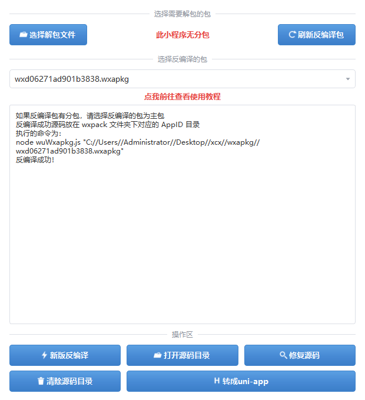

# WxapkgTool — 微信小程序反编译工具箱（GUI + 单文件 exe）

以 [Ackites/KillWxapkg](https://github.com/Ackites/KillWxapkg) 为反编译内核，套一层 Windows 图形界面，
并打包成**单文件 exe**。



```
┌─ 选择需要解包的包 ────────────────────────────────────────┐
│ [选择解包文件]          此小程序无分包          [刷新反编译包] │
├─ 选择反编译的包 ──────────────────────────────────────────┤
│ [ wxd06271ad901b3838.wxapkg                          v ]  │
│                   点我前往查看使用教程                      │
│ ┌──────────────────────────────────────────────────────┐ │
│ │ 如果反编译包有分包，请选择反编译的包为主包               │ │
│ │ 反编译成功源码放在 wxpack 文件夹下对应的 AppID 目录      │ │
│ │ 执行的命令为：                                         │ │
│ │ ...                                                   │ │
│ └──────────────────────────────────────────────────────┘ │
├─ 操作区 ──────────────────────────────────────────────────┤
│ [新版反编译]      [打开源码目录]      [修复源码]            │
│ [清除源码目录]    [        转成uni-app              ]      │
└──────────────────────────────────────────────────────────┘
```

> **不需要安装 Python，也不需要安装 Node.js**，双击 exe 即可用。

功能要点：自动解密 + 解包 · 主包与**分包一起还原** · 源码工程修复（补四件套 / 补占位组件 / 清理运行时碎片）·
**敏感信息扫描报告** · 一键转 uni-app 工程。

---

## 一、快速开始

从 [Releases](../../releases) 下载 `WxapkgTool.exe`（单文件，约 72 MB），双击运行。

首次运行会在 exe 同级目录建一个 `WxapkgToolData` 文件夹：

```
WxapkgToolData/
  wxpack/
    _packages/                  ← 解包（解密）出的包体，按 AppID 隔离
      <appid>/
        <appid>.wxapkg          ← 主包（以 AppID 命名）
        _pages_my_.wxapkg       ← 分包
        _pages_module_.wxapkg
    <appid>/                    ← 反编译出的源码目录
    <appid>_uniapp/             ← 转成的 uni-app 工程
    _decrypt_tmp/               ← 解密临时目录，用完即删
  tools/
    KillWxapkg.exe              ← 从 exe 内释放出来的反编译内核
    config/rule.yaml            ← 敏感信息扫描规则模板（内核自动生成）
  doctor.txt                    ← 环境自检报告（执行 --doctor 后生成）
```

> 包体必须按 AppID 分开存放。反编译分包要走「目录模式」（`-in` 指向包**目录**），
> 如果所有小程序的包平铺在一起，反编译 B 时会连 A 的包一起还原进 B 的源码目录。
>
> 如果 exe 放在只读目录（如 `C:\Program Files`），产出会自动落到 `我的文档\WxapkgTool`。

## 二、分包

**有分包能一起反编译。** 流程是：

1. **选择解包文件**时选到 `__APP__.wxapkg`，工具会把同目录下的 `_pages_my_.wxapkg`
   这类分包一并解密、一并归档到 `_packages\<AppID>\`。
2. 中间的红字会显示 **此小程序有分包**，日志里会列出分包文件名。
3. 点 **新版反编译**时，工具检测到该 AppID 的包目录里有分包，就自动从
   `-in=<单个包文件>` 切换成 `-in=<_packages\<AppID>\>` 的**目录模式**，
   主包 + 分包一次还原到 `wxpack\<AppID>\`。

两个限制（都是微信侧的，不是工具的问题）：

- **分包必须是「被缓存过」的**。微信只缓存用户真正打开过的分包，没进过的分包页面
  在 `Applet\packages\<AppID>\<版本>\` 下根本不存在 → 还原出来是 `<!--path-->` 占位。
  办法：在微信里进一次那些页面，缓存落盘后重新解包 + 反编译。
- **分包里页面级 `.js` 常是占位**（`Page({data:{}})`）。实测分包能还原
  `.wxml/.wxss/.json` 和内部组件的 `.js`，但分包声明页面的 js 不还原。


### 操作流程

1. **选择解包文件** — 选微信缓存里的 `__APP__.wxapkg`。
   - 工具会自动识别 AppID、自动解密，并把同目录下的分包 `_xxx_.wxapkg` 一起带上。
   - 完成后中间的红字显示 **此小程序有分包 / 此小程序无分包**。
2. **选择反编译的包** — 下拉框里挑要反编译的包（有分包时选主包；工具会自动改用目录模式，
   主包 + 分包一次还原到位）。
3. 点 **新版反编译**。
4. 点 **修复源码** 收尾，再 **打开源码目录**，用微信开发者工具「导入项目」。
5. 需要迁到 uni-app 时点 **转成 uni-app**。

### 微信小程序缓存在哪

| 微信版本 | 路径 |
|---|---|
| 4.0+ | `%APPDATA%\Tencent\xwechat\radium\Applet\packages\<AppID>\<版本号>\` |
| 4.0 前 | `%USERPROFILE%\Documents\WeChat Files\Applet\<AppID>\<版本号>\` |
| 备用 | `%APPDATA%\Tencent\WeChat\radium\Applet\` |

目录名就是 AppID。主包固定叫 `__APP__.wxapkg`，分包形如 `_pages_my_.wxapkg`。
**找不到就先在微信里打开一次该小程序**，缓存才会落盘。

---

## 三、敏感信息扫描

**默认开启**，跟「新版反编译」一起跑（内核加 `-sensitive`）。结果在源码目录根下：

```
wxpack\<appid>\
  sensitive_data.json      ← 原始结果，JSON Lines，每行一条 {"content":…, "rule_id":…}
  敏感信息报告.txt          ← 按规则分组、去重后的可读汇总
```

点 **打开源码目录** 就能看到这两个文件。

> ⚠️ **这里有个容易踩空的地方**：KillWxapkg 把 `sensitive_data.json` 写在**进程的当前工作目录**，
> **不是 `-out` 目录**，而且每次同名覆盖 —— 换个 AppID 就把上一次的冲掉了。
> 所以工具每次反编译完都会把它从内核工作目录搬到对应的源码目录下，并按 AppID 分开保存。
> 你自己手动在命令行跑 `-sensitive` 时要注意先 `cd` 到想放报告的目录。

### 规则在哪、怎么改

规则表：`WxapkgToolData\tools\config\rule.yaml`（内核首次运行自动生成，全局共用一份）

默认启用的规则覆盖：手机号、邮箱、身份证、IP、JWT、阿里云/腾讯云/京东云/AWS/火山/金山/GCP 的 AK、
私钥、GitHub/GitLab token、企业微信/钉钉/飞书/Slack webhook、grafana token、`password`、
微信 AppID / 企业微信 CorpID / 公众号 `gh_`、腾讯文档链接 等 46 条。

几条默认**没开**的（`enabled: false` 或 `pattern` 为空），要扫得自己改：

| 规则 | 默认状态 |
|---|---|
| `domain` / `path` / `domain_url` | `enabled: false` |
| `ip` | `enabled: false`（`ip_url` 是开的） |
| `secret_key` | `enabled: true` 但 `pattern` 为空，等价于不扫 |

改完直接重跑「新版反编译」即可，不需要重启工具。

### 已知噪声

- `wechat_appid` 会命中包里**所有** `"wx…"` 字符串，包括分享用的其它 AppID，噪声偏大。
- 反编译产物里的事件名可能是混淆地址（`0x7654a0`），`password` 这类规则偶尔会误报。

## 四、五个按钮到底做了什么

| 按钮 | 实现 | 说明 |
|---|---|---|
| **新版反编译** | `KillWxapkg.exe -id=<appid> -in=<包或目录> -out=<src> -restore -pretty -sensitive` | 还原完整工程目录（wxml/wxss/js/json 全套）。检测到分包时自动改用**目录模式**，`-in` 指向该 AppID 专属包目录，主包 + 分包一次还原到位。同时做敏感信息扫描，报告落到源码目录（见上一节） |
| **打开源码目录** | 资源管理器 | 打开 `wxpack\<appid>\`，可直接「导入项目」 |
| **修复源码** | 纯 Python 实现（对应社区 `postprocess.js`） | ① 删掉 `chunk_N.appservice.js` / `chunk_N.webview.js`（编译期运行时分片，最大可达 1.5 MB，还原后无人引用）② 补全 `project.config.json` 的 appid / projectname / libVersion ③ 按 `app.json` 补全页面四件套缺失文件 ④ 递归扫 `usingComponents`，给解析不到的组件补占位实现。结束后做一次体检 |
| **清除源码目录** | `shutil.rmtree` | 删掉 `wxpack\<appid>\`，会弹二次确认，不可撤销 |
| **转成 uni-app** | 纯 Python 实现 | 产出 HBuilderX 可直接打开的 uni-app 工程，见下节 |

> 早期版本里的「旧版反编译」（`node wuWxapkg.js`）已下线：它需要额外装 Node.js，
> 且对新版模板格式（`$gwx_XC_*`）还原 `.wxml/.wxss` 会失败，还会引入已停止维护、
> 存在沙箱逃逸 CVE 的 `vm2`。新版内核已经能覆盖它的能力范围。

### 命令行自检

```
WxapkgTool.exe --doctor
WxapkgTool.exe --doctor --in="<某条缓存路径>\__APP__.wxapkg"
```

把环境信息（工作目录、内核 MD5 校验、可写性、已发现的包）写到 `WxapkgToolData\doctor.txt`；
带 `--in=` 时还会真跑一次反编译并把结果写进报告。界面版是 windowed 没有控制台，
排查问题时用这个最直接。

---

## 五、转 uni-app 的转换能力

| 小程序 | uni-app |
|---|---|
| `pages/x/x.{wxml,wxss,js,json}` | `pages/x/x.vue`（template + style + script） |
| `components/y/y.*` | `components/y/y.vue` |
| `app.json` | `pages.json` + `App.vue` + `main.js` + `manifest.json` |
| 图片/字体/媒体 | `static/` |
| `wx:if` / `wx:elif` / `wx:else` | `v-if` / `v-else-if` / `v-else` |
| `wx:for` + `wx:for-item` / `wx:for-index` / `wx:key` | `v-for="(item, index) in list"` + `:key` |
| `bindtap` / `catchtap` / `bind:tap` / `capture-bind:tap` | `@tap` / `@tap.stop` / `@tap` / `@tap.capture` |
| `attr="{{x}}"` | `:attr="x"` |
| `<block>` | `<template>` |
| `Page({...})` / `Component({...})` | `export default {...}` |
| `properties` | `props`（`value` → `default`） |
| `methods: {...}` | 提升到组件顶层 |
| `usingComponents` | 注册到 `components` 选项 |
| `wx.*` | `uni.*` |

**转换不覆盖**：`wxs`、动态 `<template is>`、原生插件、`triggerEvent`/`selectComponent` 组件通信。
另外反编译产物的**事件处理器名可能仍是混淆后的地址**（如 `@tap="0x7654a0"`），需从 JS 里找回真实函数名——
这是反编译本身的局限，不是转换器的问题。

---

## 六、从源码运行 / 打包

```bash
git clone <本仓库>
cd wxapkg-gui

# 1. 拉取反编译内核（37MB，仓库里不带；直连不通会自动走镜像）
python fetch_engine.py

# 2. 依赖（只装精简版 Qt；完整版 PySide6 会多下 168MB 用不到的插件模块）
python -m pip install -i https://mirrors.aliyun.com/pypi/simple/ pyinstaller PySide6-Essentials

# 3. 生成图标（可选，仓库里已带）
python make_icons.py

# 4. 打包
python build.py            # 单文件，产物 dist/WxapkgTool.exe
python build.py --onedir   # 目录版，启动更快
```

源码方式直接运行：`python app/main.py`（此时工作目录就是项目根目录，产出落在 `wxpack/`）。
`build.py` 发现内核缺失时会自动调 `fetch_engine.py`。

依赖 Python 3.10+（`PySide6-Essentials 6.11` 要求），实测 3.13 可用。

### 目录结构

```
wxapkg-gui/
  app/
    main.py                  主界面（PySide6）+ QSS 样式 + --doctor 自检
    core/
      paths.py               工作目录解析（exe 同级 → 文档目录 回退）
      engine.py              KillWxapkg 调用 + wxapkg 解析 + 解包/解密 + 敏感信息收口
      repair.py              「修复源码」四件事 + 工程体检
      uniapp.py              「转成 uni-app」转换器
    resources/               图标（含 app.ico）
    tools/                   内核放这里（由 fetch_engine.py 下载，不入库）
  build.py                   PyInstaller 打包脚本
  fetch_engine.py            下载并校验 KillWxapkg 官方 release
  make_icons.py              图标生成
  docs/screenshot.png        界面截图
  THIRD_PARTY_NOTICES.md     第三方组件与许可
```

---

## 七、已知限制

- **反编译是「尽力而为的静态还原」**，不是提取原始源码：变量名/注释/目录结构可能缺失，还原出的
  工程不保证能直接运行。
- `.wxml` 里 `class="[xxx data-v-abc <nil>]"`、`style="padding-top:undefined"` 这类噪声是还原器的固有产物，
  不影响解析，但需手工清理。
- `bindtap=""`（事件名为空）说明原包是 **Vue / uni-app 编译产物**，事件名不在模板静态属性里，
  页面能渲染但点击无响应，逻辑仍在 `.js` 里。
- **分包没被微信缓存**（用户没进过那个分包页）→ 该分包在还原结果里是占位。
  让用户在微信里浏览一次对应页面，缓存落盘后重跑即可。
- 单文件 exe 首次启动需要把内核解压到临时目录，会慢 1~3 秒。

## 八、第三方组件与许可

| 组件 | 来源 | 许可 | 用途 |
|---|---|---|---|
| KillWxapkg v2.4.1 | [Ackites/KillWxapkg](https://github.com/Ackites/KillWxapkg) | MIT | 反编译内核（Go，UPX 压缩，37 MB） |
| PySide6-Essentials 6.11 | [Qt for Python](https://doc.qt.io/qtforpython/) | LGPL-3.0 | 图形界面 |
| PyInstaller 6.22 | [pyinstaller.org](https://pyinstaller.org/) | GPL-2.0+（含打包例外） | 打包成单文件 exe |

本项目自身代码以 **MIT** 授权，见 `LICENSE`；二进制分发的注意事项见 `THIRD_PARTY_NOTICES.md`。

**反编译能力完全来自 KillWxapkg**，本项目只做了 GUI、打包与流程编排
（分包一并还原、源码工程修复、敏感信息报告收口、转 uni-app）。

## 九、免责声明

同 [KillWxapkg](https://github.com/Ackites/KillWxapkg)：本工具**仅供学习交流与安全评估**使用。
请遵守《中华人民共和国网络安全法》及相关法律法规，勿用于侵犯他人知识产权或未经授权的商业用途。
使用者自行承担全部责任。

